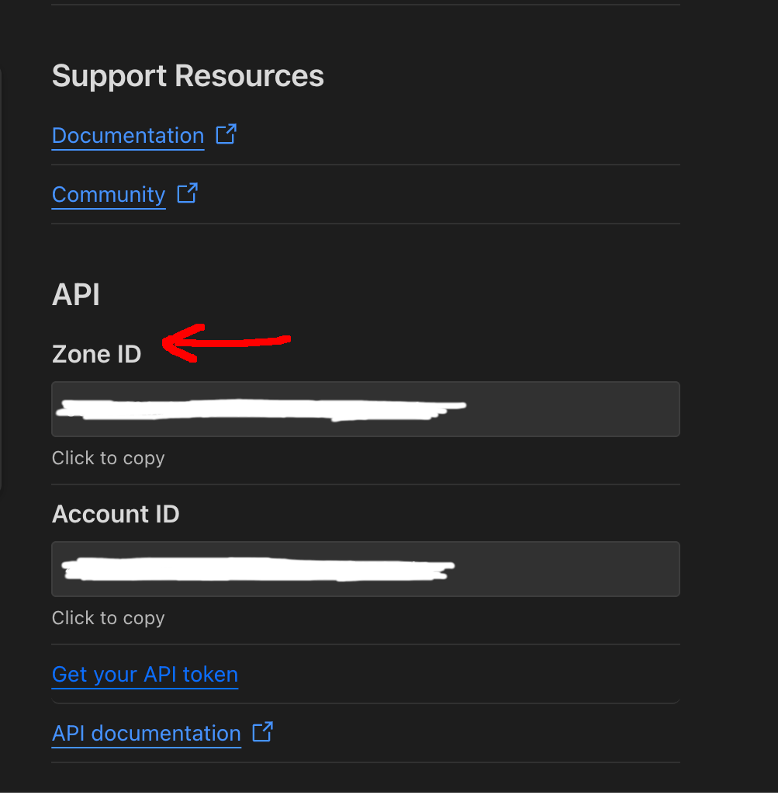

# CloudFlare DNS Updater
## Summary
This is a simple, configurable program written in Go that updates your CloudFlare DNS records automatically. It is configured via a .config file, which is located in the same directory as the program.

You can optionally set it to send Pushover notifications whenever a DNS record is updated.

## Requirements
- Go 1.23 or higher
- CloudFlare account
- Pushover account (optional)

## Usage
### Easy install with Docker

```bash
docker run -d \
  -e ZONE_ID="your_zone_id" \
  -e RECORD_NAMES="sub1.example.com, sub2.example.com" \
  -e EMAIL="your@email.com" \
  -e ACCESS_TOKEN="your_access_token" \
  -e UPDATE_INTERVAL="60" \
  -e PUSHOVER_APP_TOKEN="your_app_token" \
  -e PUSHOVER_USER_KEY="your_user_key" \
  cloudflare-dns-updater
```


### Manual Installation

1. Clone the repository
2. Copy the `.config.example` file to `.config` in the same directory as the program
3. Edit the .config file to your liking
4. Run the program with `go run .` or `go run main.go`


### Install Pre-Compiled Binary

There is currently a pre-compiled binary for Linux x64 under [releases](https://github.com/amr-as90/cloudflare-dns-updater/releases/), if you would like to use this, follow these instructions instead.

1. Download the binary
2. Create a .config file with `touch .config`
3. Copy the contents of the .config.example found in the repo into the .config file you just created
4. Fill out the fields accordingly


## Configuration

The configuration file consists of mandatory and optional fields. The mandatory fields are:
1. Zone ID
2. API Token
4. DNS Record Name's

### 1. Zone ID
The Zone ID is the Zone ID of the domain name on your CloudFlare account you want to update. You can find it by navigating to your [CloudFlare dashboard](https://dash.cloudflare.com) and selecting the domain name you wish to update. The Zone ID is located at the bottom of the page on the right side:



### 2. API Token
The API Token is the API Token of your CloudFlare account. You can find it by navigating to your [CloudFlare dashboard](https://dash.cloudflare.com), under Manage Account -> Account API Tokens.

1. Create a new token with the *Edit Zone DNS* template, add a 'Zone DNS Read' Permission to it as well as a 'Zone DNS Edit' Permission.
2. Under *'Zone Resources'*, select the zone you wish to update.
3. Name the token whatever you like and create it.


4. Copy the API Token and paste it into the `.config` file under *'ACCESS_TOKEN'*.

```
ACCESS_TOKEN="YOURACCESSTOKEN"
```

> **_NOTE:_**  The edit permission is required to update the DNS records, the read permission is required because the program automatically gets the DNS record ID's from your CloudFlare account, based on the domain name's you provided.

### 3. DNS Record Names
The DNS Record Names are the names of the DNS records you wish to update. For example:

```
RECORD_NAMES="subdomain1.example.com, subdomain2.example.com, subdomain3.example.com"
```

Multiple entries are supported and are separated by a comma as shown in the example. The program assumes these records already exist in your CloudFlare account.


### Optional Fields

Cloudflare DNS Updater supports setting the update interval to check for IP address changes. The default interval is 60 seconds, but you can change it by setting the `UPDATE_INTERVAL` variable in the `.config` file, this will be read in seconds, i.e.:
```
UPDATE_INTERVAL="10"
```
Checks the IP address for any changes every 10 seconds, and updates if a change in IP address has been detected.

## Pushover
Pushover is a notification service that allows you to send notifications to your phone or other devices. Pushover is optional and can be enabled by setting the  `PUSHOVER_APP_TOKEN` and `PUSHOVER_USER_KEY` variables to your Pushover API token and user key, respectively. 

Leave these blank if you do not wish to use Pushover.

